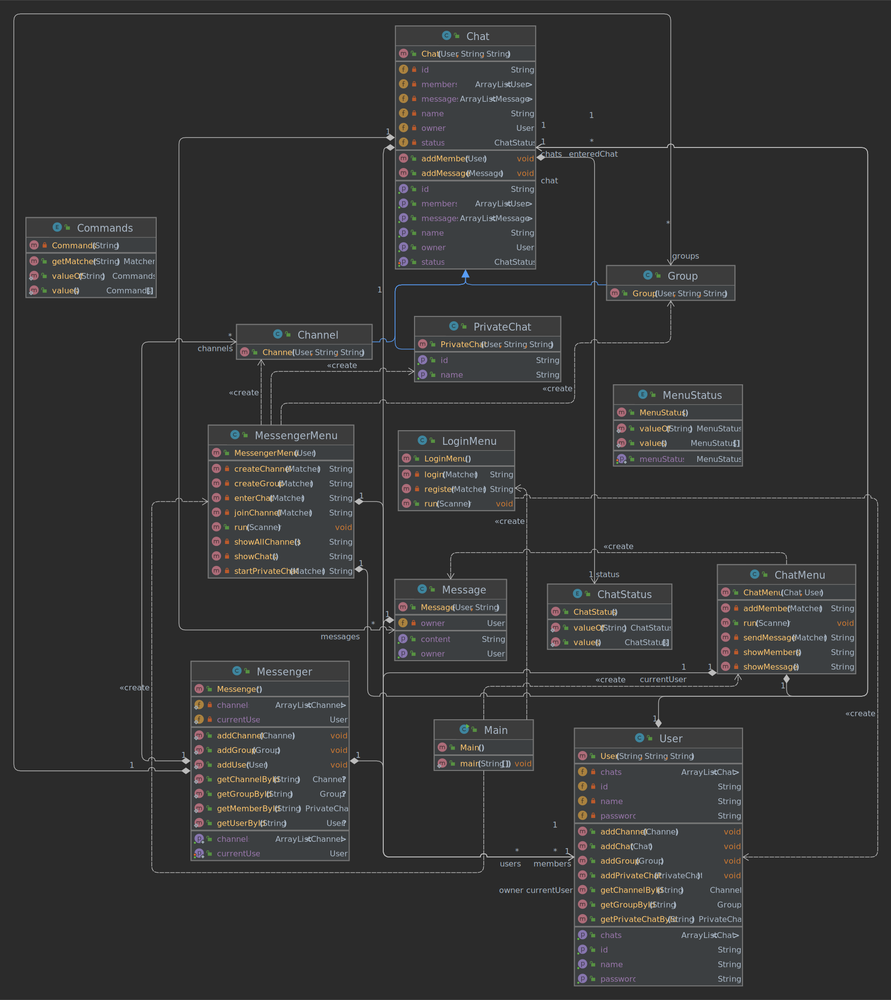

# Telegram Console App

This Telegram Console App is a simple Java application designed to use Simple Telegram via command line interface. It allows users to perform various actions such as sending messages, creating channels, joining groups, and more.

## Features

- **User Authentication:** Register and login with your Telegram ID and password.
- **Channel Management:** Create new channels, join existing channels, and view all available channels.
- **Group Management:** Create new groups and add members to existing groups.
- **Chat Navigation:** Start private chats, enter existing chats, and view all your ongoing chats.
- **Message Interaction:** Send messages to chats, view all messages in a chat, and manage chat members.
- **Logout:** Safely logout from your Telegram account.

## Preview



## Description Document

For detailed information on how to use the app, including command syntax and usage guidelines, please refer to the [Description Document PDF](description_document.pdf).

## Requirements

- Java Development Kit (JDK) 8 or higher


## Installation

1. Clone this repository to your local machine:
```
git clone https://github.com/your-username/telegram-console-app.git
```
2. Compile the Java source code:

```
cd telegram-console-app
javac *.java
```
3. Run the application:
```
java Main
```

4. Follow the on-screen instructions to authenticate your Telegram account and start using the app.

## Commands
Below are the available commands and their syntax:
- **Register:** `register i <id> u <username> p <password>`
- **Login:** `login i <id> p <password>`
- **Exit:** `exit`
- **Show All Channels:** `show all channels`
- **Create Channel:** `create new channel i <id> n <name>`
- **Join Channel:** `join channel i <id>`
- **Show My Chats:** `show my chats`
- **Create Group:** `create new group i <id> n <name>`
- **Start Private Chat:** `start a new private chat with i <id>`
- **Logout:** `logout`
- **Enter Chat:** `enter <chatType> i <id>`
- **Send Message:** `send a message c <message>`
- **Add Member:** `add member i <id>`
- **Show All Messages:** `show all messages`
- **Show All Members:** `show all members`
- **Back:** `back`

Simply type the desired command followed by its parameters to execute it.
